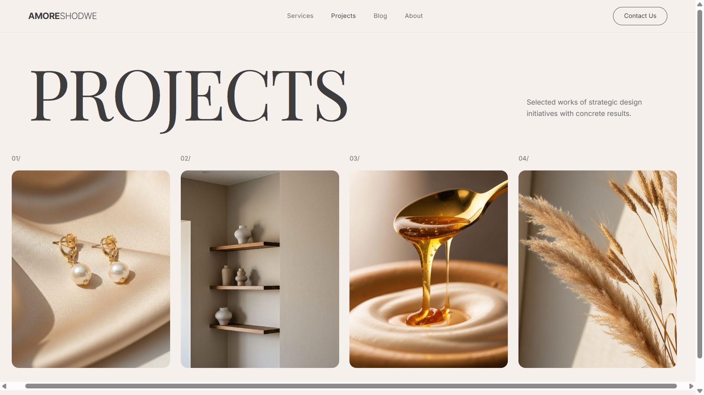
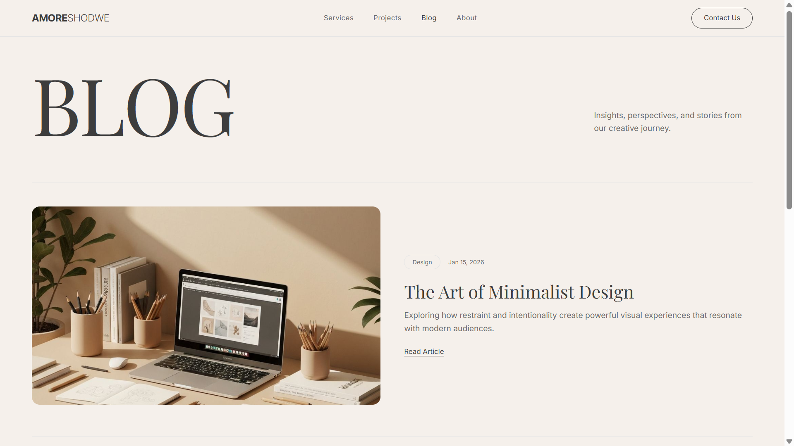
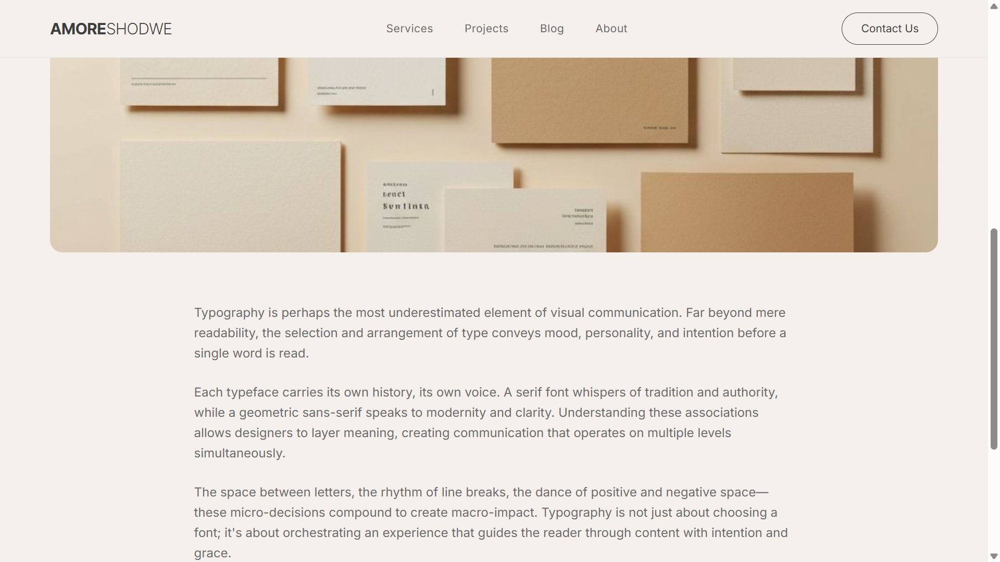

# Amore Shodwe

**Live Site:** https://amore-shodwe.vercel.app/

## Screenshots

**Home Page**  









## Overview

Amore Shodwe is a modern, responsive web application designed to present digital services, projects, and content in a structured and visually refined way. The platform follows a scalable, component-based architecture and reflects current best practices in frontend development and UI design.

This project is intended to serve as a foundation for business websites, SaaS landing pages, or agency portfolios, with a strong focus on performance, usability, and clean aesthetics.


## Features

* Responsive layout optimized for desktop, tablet, and mobile devices
* Modular and reusable component system
* Dynamic routing for blog posts and project pages
* Structured content sections for services, projects, and contact
* Clean and minimal user interface
* Optimized performance using modern web technologies


## Tech Stack

* **Framework:** Next.js (App Router)
* **Language:** TypeScript
* **Styling:** Tailwind CSS
* **UI System:** Component-based design with reusable UI primitives
* **Deployment:** Vercel


## Project Structure

```
app/            Application routes and pages
components/     Reusable UI components
hooks/          Custom React hooks
lib/            Utility functions
public/         Static assets
styles/         Global styles
```


## Getting Started

### Clone the repository

```bash
git clone https://github.com/hamnahA/Amoree-shodwe.git
```

### Install dependencies

```bash
npm install
# or
pnpm install
```

### Run the development server

```bash
npm run dev
```

Access the application at:

```
http://localhost:3000
```


## Use Cases

This project can be adapted for:

* Business or agency websites
* SaaS product landing pages
* Personal or professional portfolios
* Content-driven platforms with blog functionality


## Deployment

The project is deployed on Vercel. To deploy your own version:

1. Push the repository to GitHub
2. Import the project into Vercel
3. Configure environment settings if required
4. Deploy

## Future Enhancements

* Authentication and user management
* CMS integration for dynamic content
* API integrations
* Dashboard and admin panel
* Payment processing capabilities


## Author

Hamnah Ansari

